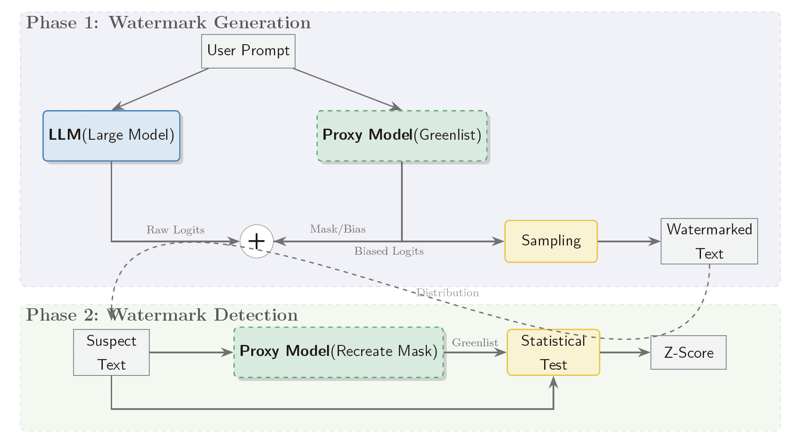

# Proxy-Logits-Guided Code Watermarking

A method for watermarking LLM code generations. By default, it uses **Qwen3-Coder-30B-A3B** as the generation model.

The method gradually introduces watermarks by modifying logits during token generation, which can then be detected from the generated code using the same secret key.

---

## Method Overview

The approach uses a small model trained on Fill-in-the-Middle (FIM) code completion (**Qwen2.5-Coder-1.5B-Instruct**) alongside the main code LLM to generate watermarked code.

During generation, the smaller model operates in a sliding window manner, evaluating next token variants to avoid enforcing watermarks at grammar-critical positions. This greatly helps to preserve code quality while embedding the watermark.



---

## Installation

We recommend using the [uv package manager](https://docs.astral.sh/uv/getting-started/installation/) for dependency management.

```bash
# Clone and enter the project directory
git clone <repository-url>
cd <project-folder>

# Create virtual environment and install dependencies
uv venv .venv
uv pip install vllm --torch-backend=auto
uv pip install modelscope accelerate

# Optional: Install LiveCodeBench for evaluation
cd third_party/LiveCodeBench
uv pip install -e .
cd ../../
```

Before running any commands, activate the environment:

```bash
source env.sh
```

---

## Quick Start

### 1. Start the Server

We provide several serving scripts depending on your hardware:

- `serve.sh` — Full BF16 precision of Qwen3-Coder-30B-A3B, requires more VRAM
- `serve_quant.sh` — NVFP4 quantized version, recommended for most users
- `serve_small.sh` — For debugging and development

### 2. Interact with the Model

Once the VLLM endpoint is running at `http://127.0.0.1:8000/v1`, you can send standard OpenAI-compatible requests—responses are automatically watermarked.

For a quick demo with built-in watermark detection:

```bash
python interact_with_detector.py --detection-method proxy --enable-watermark-detection
```

Note that watermark detection works best with longer outputs. It's typically difficult to reliably detect watermarks in code snippets under ~100 tokens.

---

## Project Structure

```
.
├── env.sh                        # Watermark parameters & FIM template configuration
│
├── serve.sh                      # Full BF16 serving script
├── serve_quant.sh                # Quantized (NVFP4) serving script
│
├── interact.sh                   # Basic interaction demo
├── interact_with_detector.py     # Interaction demo with watermark detection
│
├── eval_lcb.sh                   # LiveCodeBench evaluation script
|
├── logit_processors/
│   ├── proxy_model.py            # Manages proxy model state and its interaction 
│   │                             # with active request in VLLM
│   ├── watermark.py              # Core logic for watermark computation and detection
│   └── watermark_adapter.py      # Implements the batched logit processor interface of VLLM
```

The watermark parameters (secret key, window size, thresholds, etc.) are all configured through environment variables in `env.sh`.

The key components work together as follows: `watermark_adapter.py` implements the VLLM logits processor interface, hooking into the generation loop. At each step, it invokes `proxy_model.py` to run the smaller FIM model in a sliding window over the current context, then uses `watermark.py` to determine which tokens can be safely watermarked without breaking code syntax. 

---

## Evaluation

We use [LiveCodeBench](https://github.com/LiveCodeBench/LiveCodeBench) to evaluate model performance and ensure watermarking does not degrade code quality.

```bash
./eval_lcb.sh
```

---

## Acknowledgments

This work builds upon several existing watermarking methods, including [WLLM](https://github.com/jwkirchenbauer/lm-watermarking) for the greenlist/redlist approach, [ACW](https://github.com/TimeLovercc/code-watermark) and [SWEET](https://github.com/hongcheki/sweet-watermark) for code-specific techniques, and [MarkLLM](https://github.com/THU-BPM/MarkLLM) for certain implementations.

We thank all the authors for their open-source contributions.